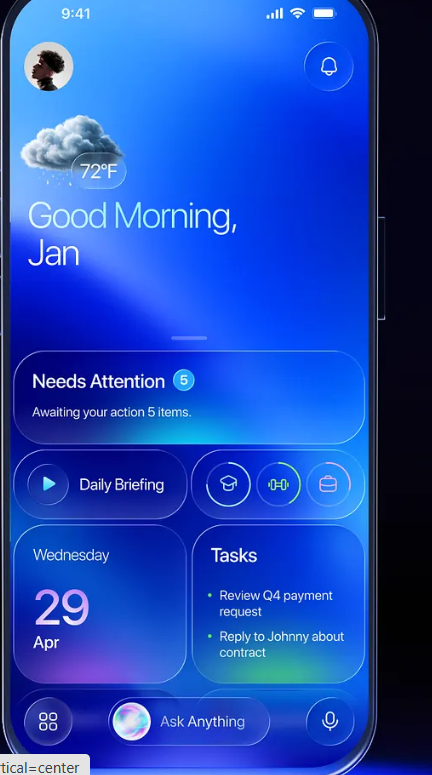

# FocusList 🎯

FocusList is a production-quality, frontend-only To-Do web application built for speed, focus, and modern productivity. It operates completely in the browser, persisting all data using LocalStorage.



## ✨ Key Features

- 📝 **Task Management**: Create tasks with High, Medium, or Low priority.
- ✏️ **Inline Card Editing**: Quick inline editing with `Enter` (Save) and `Escape` (Cancel) keyboard shortcuts.
- 🗑️ **Deletion Safety**: Custom modal dialog prevents accidental deletions.
- 🎨 **Dark & Light Mode**: Persistent theme toggle with OS preference auto-detection.
- 🔍 **Real-time Search & Multi-Filters**: Instant title search combined with status (*All*, *Active*, *Completed*) and priority filters.
- 📊 **Master Statistics**: Live count of Total, Completed, and Pending tasks.
- 💾 **LocalStorage Persistence**: Safe JSON parsing and defensive schema validation.
- 📱 **Responsive & Accessible**: Touch-friendly controls, minimum 44px targets, zero horizontal overflow, and WCAG accessibility standards.

## 🛠️ Tech Stack

- **Framework**: React 19 + TypeScript
- **Bundler**: Vite
- **Styling**: Tailwind CSS v4
- **Icons**: Lucide React
- **State & Persistence**: React Hooks + LocalStorage API

## 🚀 Getting Started

### Prerequisites
- Node.js (v18+ recommended)
- npm

### Installation & Local Run

```bash
# Clone the repository
git clone <repository-url>

# Navigate to project directory
cd focus-list

# Install dependencies
npm install

# Start development server
npm run dev
```

### Build for Production

```bash
npm run build
```

The production assets will be output to the `dist/` directory, ready to be hosted on Vercel, Netlify, or GitHub Pages.

---
Created with FocusList • Your daily productivity companion
